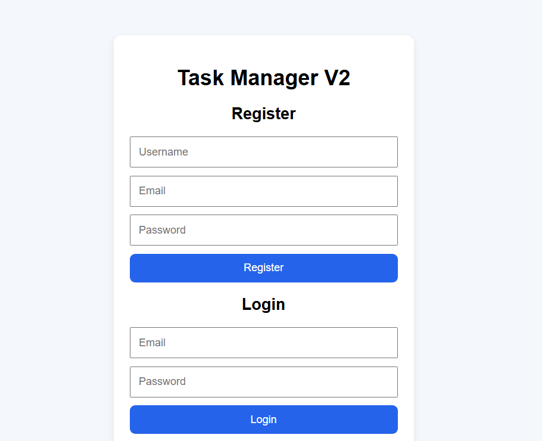
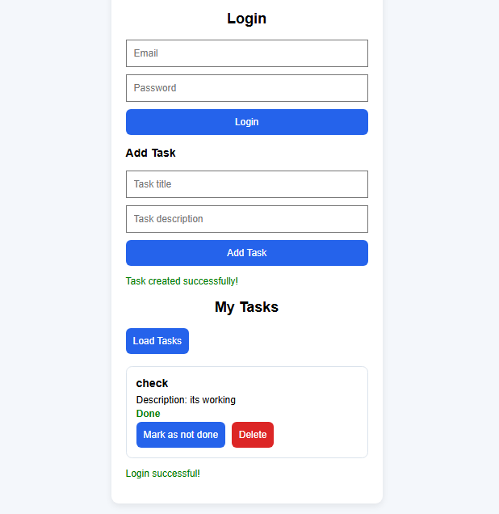
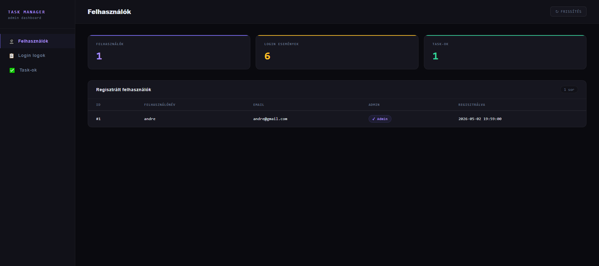

# Task Manager v2

A Python Flask-based task management application built as a junior backend / web development portfolio project.

The goal of this project is to demonstrate practical backend fundamentals: user authentication, JWT-protected routes, user-scoped CRUD operations, SQL persistence, frontend-backend communication, and a clean Route / Service / Repository project structure.

## Why I Built This

I built this project to practice the full flow of a small web application: registering users, authenticating them with JWT tokens, storing data in a database, protecting endpoints, and allowing each user to manage only their own tasks.

The focus was not only on making the application work, but also on understanding how backend code can be structured, how responsibilities can be separated between routes, services, and repositories, and how a frontend communicates with a JSON-based API.

This project helped me move from simply learning syntax to understanding how different parts of a web application work together.

## Main Features 

- User registration
- Password hashing with Werkzeug
- Login with JWT token authentication
- Protected task endpoints
- User-specific task listing
- Task creation
- Task completion status toggle
- Task deletion
- Simple HTML, CSS, and JavaScript frontend
- Basic admin dashboard
- Login event logging
- SQLite database
- Route / Service / Repository layered structure

## Screenshots

### Home / Authentication Page



### Task Dashboard



### Admin Panel



## Tech Stack

- Python
- Flask
- Flask-CORS
- PyJWT
- Werkzeug
- SQLite
- HTML
- CSS
- JavaScript
- Git
- GitHub

## Project Structure

```text
task_manager/
├── app.py
├── config.py
├── requirements.txt
├── .env.example
├── database/
│   ├── db.py
│   └── schema.sql
├── frontend/
│   ├── index.html
│   ├── app.js
│   ├── style.css
│   ├── admin.html
│   ├── admin.js
│   └── admin.css
├── models/
│   ├── user.py
│   └── task.py
├── repositories/
├── routes/
├── services/
└── utils/
```

## Architecture Overview

The project follows a simple layered structure:

- **Routes** handle HTTP requests and responses.
- **Services** contain the main business logic and validation flow.
- **Repositories** handle database operations.
- **Models** represent the main application entities.
- **Utils** contain reusable helper logic such as JWT handling.
- **Frontend files** communicate with the backend through JSON requests.

This structure helped me understand how to keep route handlers smaller, separate business logic from database logic, and make the project easier to reason about as it grows.

## Running Locally

### 1. Clone the repository

```bash
git clone https://github.com/GordonBlo/task-manager-flask-jwt.git
cd task-manager-flask-jwt
```

### 2. Create a virtual environment

```bash
python -m venv .venv
```

### 3. Activate the virtual environment on Windows

```bash
.venv\Scripts\activate
```

### 4. Install the dependencies

```bash
pip install -r requirements.txt
```

### 5. Start the application

```bash
python app.py
```

### 6. Open the application in the browser

```text
http://127.0.0.1:5000/
```

Admin page:

```text
http://127.0.0.1:5000/admin
```

## API Endpoints

### Authentication

```text
POST /api/auth/register
POST /api/auth/login
```

### Tasks

```text
GET    /api/tasks/
POST   /api/tasks/
GET    /api/tasks/<task_id>
PUT    /api/tasks/<task_id>
PATCH  /api/tasks/<task_id>/toggle
DELETE /api/tasks/<task_id>
```

### Admin

```text
GET /api/admin/users
GET /api/admin/logs
GET /api/admin/tasks
```

Admin endpoints require a user account where `is_admin = 1` in the database.

## Manual Testing

The main application flows were manually tested through the browser and API behavior:

- Registering a new user
- Logging in and receiving a JWT token
- Creating tasks for the authenticated user
- Listing only the current user's tasks
- Toggling task completion status
- Deleting user-owned tasks
- Checking that task operations are scoped to the authenticated user
- Verifying login activity logs in the admin panel

Although automated tests are not implemented yet, this project was built with a focus on understanding the expected behavior of each feature and manually checking the most important user flows.

## Security Principles

This project includes several basic security-focused practices:

- Passwords are not stored in plain text.
- Password hashing is handled with Werkzeug.
- The backend identifies the current user based on the JWT token.
- Protected task endpoints require authentication.
- Task operations include user ownership checks.
- A user should only be able to view, update, or delete their own tasks.
- The frontend avoids directly rendering user-provided task content through raw `innerHTML` where possible.

This is not a production-ready security implementation, but it demonstrates important backend security fundamentals for a junior-level portfolio project.

## AI-Assisted Development

I used AI tools as a learning and productivity assistant while building this project.

AI helped me reason through backend structure, authentication flow, debugging errors, HTTP status codes, frontend-backend communication, and the separation between routes, services, and repository logic.

I did not treat AI-generated suggestions as automatically correct. I verified the implementation by running the application, testing the main flows manually, checking database behavior, reviewing the code step by step, and making sure I understood why each part worked.

This made the development process faster, but more importantly, it helped me understand the system more deeply instead of only copying code.

## What This Project Demonstrates

This project demonstrates my understanding of:

- Flask routes and HTTP methods
- REST API fundamentals
- User registration and login flow
- JWT-based authentication
- User-scoped authorization logic
- SQL CRUD operations
- Password hashing
- Layered backend structure
- Basic frontend-backend communication
- Manual testing of core application flows
- Git and GitHub project presentation
- AI-assisted debugging and learning

## Future Improvements

Planned improvements for this project include:

- Add unit tests for services and repository functions
- Add integration tests for authentication and protected task endpoints
- Add task editing from the frontend
- Add task priority field
- Add due date field
- Add search and filtering
- Improve the UI with Bootstrap or Tailwind CSS
- Add PostgreSQL support
- Deploy the project to Render or Railway
- Improve admin permission management
- Add better error messages and form validation

## Project Status

This project is currently a junior portfolio project. It is not intended to be a production-ready application, but it demonstrates practical backend and web development fundamentals through a complete, working example.

## Author

**Richard Peter André**

- GitHub: [github.com/GordonBlo](https://github.com/GordonBlo)
- LinkedIn: [linkedin.com/in/richard-peter-andre-097b3b24a](https://www.linkedin.com/in/richard-peter-andre-097b3b24a)
